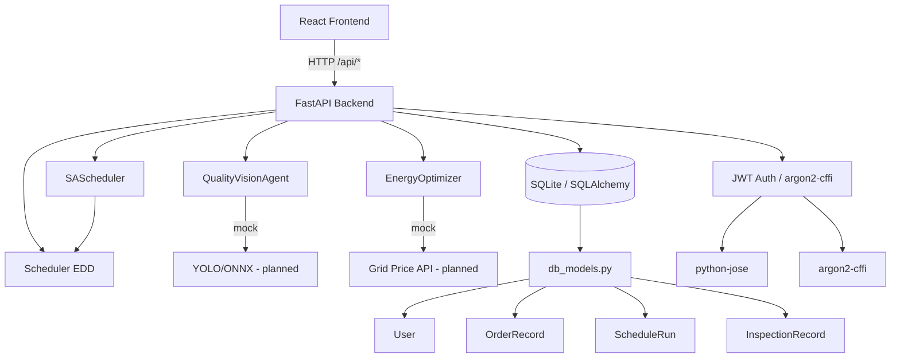

# MillForge Dependency Map

**Generated**: 2026-03-23

## Runtime Dependency Graph



## Python Dependencies (`backend/requirements.txt`)

| Package | Version | Purpose | Risk |
|---------|---------|---------|------|
| fastapi | 0.115.5 | Web framework | Low |
| uvicorn[standard] | 0.32.1 | ASGI server | Low |
| pydantic | 2.10.3 | Schema validation | Low |
| python-dotenv | 1.0.1 | Env config | Low |
| httpx | 0.28.1 | HTTP client (tests) | Low |
| sqlalchemy | 2.0.36 | ORM | Low |
| alembic | 1.14.0 | Migrations (not yet used) | Low |
| python-jose[cryptography] | 3.3.0 | JWT | **Medium** — uses deprecated `datetime.utcnow()` internally; monitor for upstream fix |
| argon2-cffi | 23.1.0 | Password hashing | Low |
| pytest | 8.3.4 | Testing | Dev only |
| pytest-asyncio | 0.24.0 | Async test support | Dev only |

## Node/Frontend Dependencies (key)

| Package | Purpose | Risk |
|---------|---------|------|
| react 18 | UI framework | Low |
| vite | Build/dev server | Low |
| tailwindcss | Styling | Low |
| @vitejs/plugin-react | JSX transform | Low |

## Internal Module Dependencies

```
main.py
  └── routers/auth_router.py     → auth/dependencies.py, auth/jwt_utils.py, db_models.py
  └── routers/orders.py          → agents/scheduler.py, agents/sa_scheduler.py, db_models.py, models/schemas.py
  └── routers/schedule.py        → agents/scheduler.py, agents/sa_scheduler.py, models/schemas.py
  └── routers/quote.py           → agents/scheduler.py, models/schemas.py
  └── routers/vision.py          → agents/quality_vision.py, db_models.py, models/schemas.py
  └── routers/contact.py         → models/schemas.py

agents/sa_scheduler.py → agents/scheduler.py (imports Order, Schedule, ScheduledOrder, Scheduler, SETUP_MATRIX)
agents/energy_optimizer.py → standalone (no internal deps)
```

## Cross-Cutting Concerns

| Concern | Current Implementation | Planned |
|---------|----------------------|---------|
| Auth | JWT in Authorization header | httpOnly cookie |
| Persistence | SQLite file | PostgreSQL |
| CV model | Mock random | YOLO/ONNX |
| Energy pricing | Static 24h curve | EIA/Electricity Maps API |
| Migrations | Alembic installed but unused | Alembic version files |
| Observability | stdlib logging | Prometheus /metrics |
| Rate limiting | None | slowapi or middleware |

## Risk Register

| Risk | Severity | Mitigation |
|------|---------|-----------|
| python-jose deprecated internals | Low | Warning only; watch for 3.4.x release |
| No DB migrations | Medium | Add Alembic version files before first prod deploy |
| No rate limiting | Medium | Add slowapi before public exposure |
| SA runs full 12k iterations for lead time quote | Medium | Switch quote endpoint to EDD |
| JWT in localStorage | Medium | Switch to httpOnly cookie for production |
| SQLite not suitable for concurrent writes | High | Switch to PostgreSQL before multi-user load |
